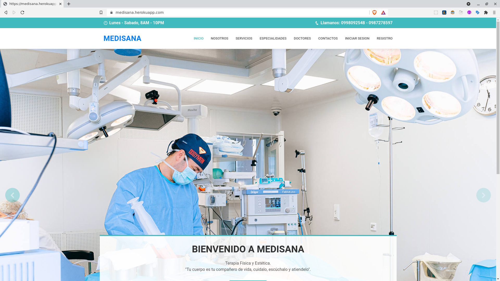

<h1 align="center">Proyecto integrador septimo 👋</h1>

<p>

  
  <a href="#" target="_blank">
    
  </a>
</p>

## Install

```sh
npm install
```

## Usage

```sh
npm run start
```

## Development

```sh
npm run dev
```

## Authors

- 👤 **Bryan Imbaquingo**
- 👤 **Kevin Changoluisa**

### Open you browser and then write

```
localhost:3000
```
